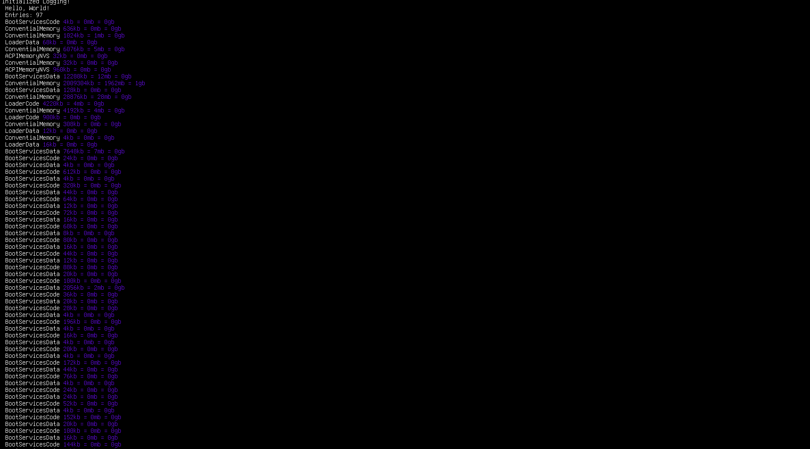

# Esque
A modern microkernel kernel with ELF Executables - Uniting Past and Present

## Warning
While working, some parts of the operating system are in dire need of
renewal. For example, the Application Launcher simply malloc's a pointer
that is big enough to load the ELF. Additionally, Mapping Memory has issues.

## Philosophy
Esque is a Unix-esque operating system. This means that while everything is a file,
not only Read-Write Operations are supported as this leads to an extremely
obfuscated interface where the writing of weird magic numbers to a file
is good practice. Esque replaces this system by a Command-Based system.

As an example, the command `0` is open, the command at `1` is close,
at `2` is read and at `3` is write. But, this system can be extended. The interface
is made easy through the `FileOperations` struct.

The following is a valid FileOperations struct:
```rs
#[repr(C)]
pub struct FileOperations {
    open: extern "C" fn(node: *mut FsNode, file: *mut File) -> i32,
    close: extern "C" fn(node: *mut FsNode, file: *mut File) -> i32,
    read: extern "C" fn(file: *mut File, buf: *mut u8, len: usize, offset: *mut isize) -> isize,
    write: extern "C" fn(file: *mut File, buf: *const u8, len: usize, offset: *mut isize) -> isize,
    commands: [*mut (); 251] // 251 (COMMAND_MAX - 4 (255 minus open, close, read and write)) of void*ers representing functions commands[0] is equal to calling actual_commands[0 + 4]
}
```

Due to this, the following would be valid
```rs
pub fn write_to_framebuffer(byte: u8, x: u32, y: u32) -> i32 {
    // The Following does not use the traditional C-like interface,
    // but uses the Rust-Layer
    let file = open("/Devices/Framebuffer");
    // The Macro is required. It matches the amount of arguments given
    // and passes them to the correct function (file.command, file.command1, file.command2, file.command3, ...)
    command!(file, CMD_FB_CLEAR_COLOUR, 0xff); // Make Screen White
    let (width, height) = {
        // Command can be used here as there are no other arguments.
        // The Wrapper command< T > returns the result of the command
        // Casted to T
        let width: u32 = file.command(CMD_FB_GET_HEIGHT);
        let height: u32 = file.command(CMD_FB_GET_WIDTH);
        (width, height)
    };
    if x > width || y > height || x < 0 || y < 0 {
        return Error::Inval;
    }
    // This is not performant
    let pix = file.read(size_of::<u8>() /* len */, Offset::new(x * y) /* Offset */);
    if pix == byte {
        return 0;
    }
    let bytes_written = file.write(byte, size_of::<u8>() /* len */, Offset::new(x * y) /* Offset */);
    assert_eq!(bytes_written, size_of::<u8>())
    return 0;
}

```

The following represents a device
```rs
#[repr(C)]
pub struct Device {
    name: [u8; 255 /* DEVICE_NAME_MAX */], // C-Compatibility
    operations: FileOperations,
}
```

## Screenshots

A Blue Screen of Death in Esque (Kernel Panic)


A simple dump of the memory map

## The InitRamFs
In the InitRamFs, as of right now, no directories are supported.
You can create a new InitRamFs simply by putting files into the `initramfs/` subdirectory.
Then, using `make initramfs` the finished initramfs is going to be found in `build/initramfs.tar`. The bootloader expects this file to be found on the root partition.

All files ending with `.ko` will then be loaded by the InitRamFs. The most vital
file might be the `initfs.ko` file, which is responsible for setting up the *root* partition of the filesystem. The default `initfs.ko` will try to load an `ext2` filesystem.

### InitFs.ko
If you are interested in what the `initfs.ko` must do, please read the [Documentation](Documentation/modules/initfs.md)

## Building (Using y.py)

`y.py` is an utility inspired by rustc's `x.py`. You can configure
the kernel using the `Esque.toml` file that may be found in the sysroot of this directory.

You can build the project simply using
```
./y.py build
```
This system is very configurable. Simply type
```
./y.py --help
```
to see all options.

## Building (Using the deprecated Makefile)

Run
```
make build
```
Then, run
```
make run
```
to run the OS using QEMU.

To clean, use
```
make clean
```

## About Unsafe
While it is true that an operating system without unsafe code is impossible,
I tried to limit it in here. At any point, 
```
make unsafe-counter
```
may be invoked which will display information about the unsafe-ness of the code.
At the time of writing, the following output is produced:
```
A total of 52 occurences have been found (1641 LOC, 0 Percent)
```


## Roadmap
- [x] Own Bootloader
- [x] Font Loading
- [x] GDT
- [x] IDT
- [x] All Faults Handled
- [x] Port-IO
- [x] Fallback Drivers for Fallback-Shell (For debugging purposes)
- [x] Level 4 Paging
- [x] PS2 Keyboard
- [x] Keyboard Layout Crate
- [x] Memory Allocation
- [x] Support the `alloc` crate
- [ ] Remapping the Page Table
- [ ] Syscalls
- [ ] Executables
- [x] Heap
- [ ] Load Kernel Modules
- [x] Load the InitRamFs
- [x] Finish the Ext2 driver
- [ ] Release Milestone 1  